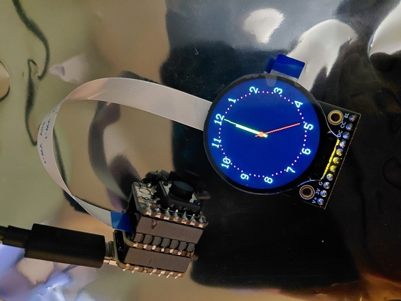
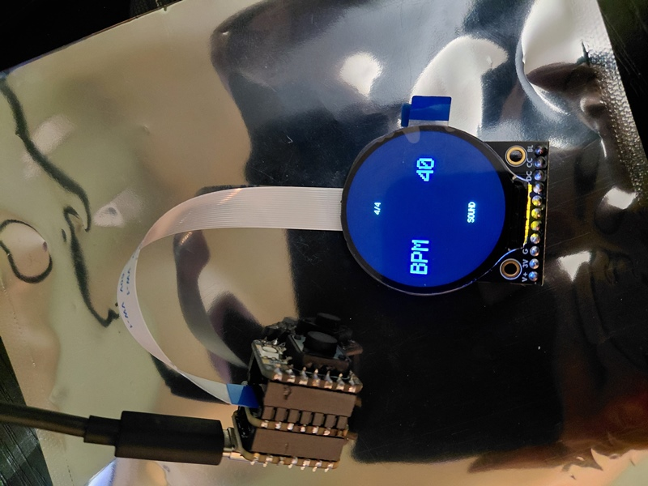
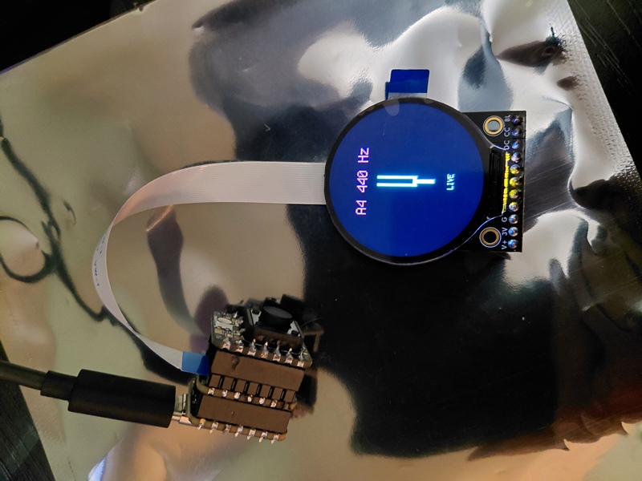
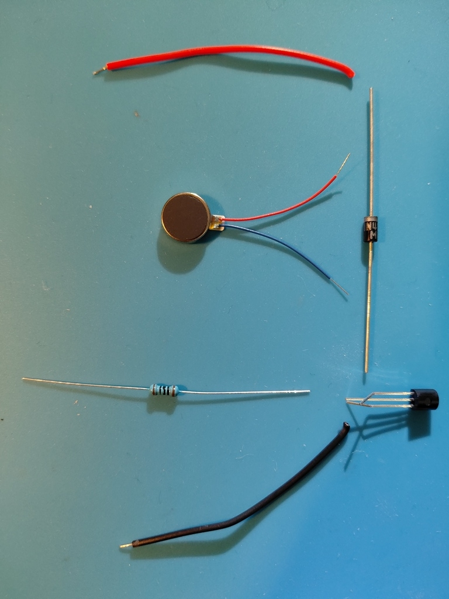
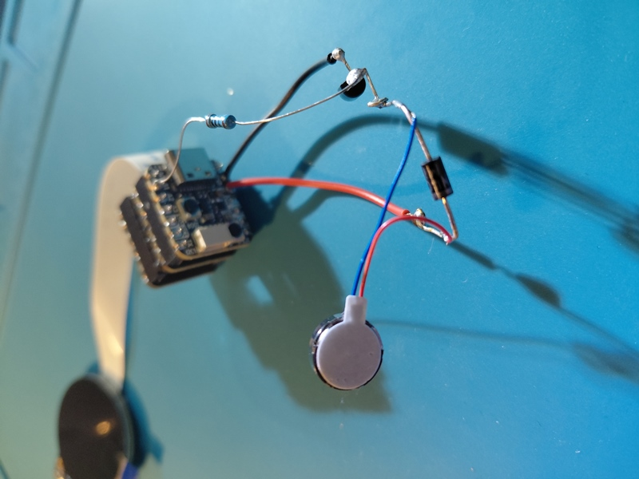

Disclaimer. This is a work in progress. Open source proof of concept provided. Screenshots and video provided. Documentation is subject to change.

Clock + Metronome + Tuner wristwatch. The clock draws hands directly onto a bitmap, the metronome animates pre-computed note sprites and the tuner renders a vector tuning fork. All modes use labels. All modes have settings and controls. Reference document has control scheme and other tidbits. 

Dev Enviornment: Mu https://codewith.mu/en/

Microcontroller: QTpy RP2040 https://www.adafruit.com/product/4900

Circuitpython for QTpy RP2040: https://circuitpython.org/board/adafruit_qtpy_rp2040/

Additonal Hardware: EYESPI BFF https://www.adafruit.com/product/5772, IoT Button BFF https://www.adafruit.com/product/5666, Vibration Mini Motor https://www.adafruit.com/product/1201

Display: 1.28" Round TFT https://www.adafruit.com/product/6178

Circuitpython 10.x libraries: https://circuitpython.org/libraries

https://github.com/user-attachments/assets/00a04122-98c7-4e2a-a195-a43d13c6c467

Vibration circuit layout. A transistor and resistor are used to make it possible for the QTpY to control the motor with 3 volts. A diode is used as a flyback for when the motor stops running. The transistor connects to the black wire, the resistor and the diode. The black wire goes from the emitter lead of the transistor to ground. The resistor(100ohm) connects the base lead of the transistor to A1. The anode portion of the diode connects to the collector lead of the transistor. The cathode porton of the diode connects to the red wire. The red wire connects to 3.3 volts. The driver motor connects to each side of the diode. Blue to anode and red to cathode. 

Component list: 100Ω resistor, diode(1N4007) and transistor(2N2222)

Soldered vibration circuit.

https://github.com/user-attachments/assets/0c229e03-611d-4f90-9194-24d2ad153cdb

https://github.com/user-attachments/assets/ea14efcf-dfc6-47f1-8c45-b138b7211cc2

