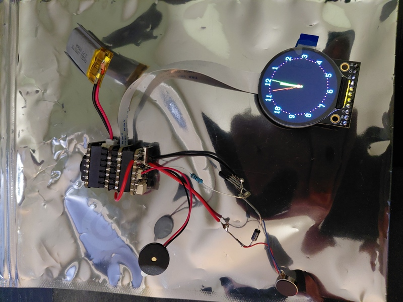

Disclaimer. This is a work in progress. Open source proof of concept provided. Screenshots and video provided. Documentation is subject to change.

NOTICE! Due to memory limits a second python file was created. sprites.py is required. Place next to code.py in the CIRCUITPY drive. The follwing lines need to be added to boot.py: "import displayio" and below that "displayio.release_displays()"

Clock + Metronome + Tuner wristwatch is the goal of this project. In addition. There are standalone files for each mode.

Dev Enviornment: Mu https://codewith.mu/en/, KiCAD https://www.kicad.org/

Microcontroller: QTpy RP2040 https://www.adafruit.com/product/4900

Circuitpython for QTpy RP2040: https://circuitpython.org/board/adafruit_qtpy_rp2040/

Circuitpython 10.x libraries: https://circuitpython.org/libraries

Display: 1.28" Round TFT https://www.adafruit.com/product/6178

Prototype 1 Additonal Hardware: EYESPI BFF https://www.adafruit.com/product/5772, IoT Button BFF https://www.adafruit.com/product/5666, Vibration Mini Motor https://www.adafruit.com/product/1201, Piezo Buzzer https://www.adafruit.com/product/1740, LIPO Charger BFF https://www.adafruit.com/product/5397, 400mAh LIPO Battery https://www.adafruit.com/product/3898

Prototype 2 Hardware Changes: IoT Button BFF removed. Prototype board added. SMD parts replace THT parts. Buttons added. Piezo replaced with magnetic transducer.

Prototype 3 Hardware changes: EYESPI BFF removed. Prototype board updated. SMD FPC added.

NOTE: Place the following in the lib folder: adafruit_bus_device folder, adafruit_display_text folder, adafruit_gc9a01a.mpy and adafruit_ticks.mpy. 

NOTE: Add the following to the requirements folder: adafruit_bus_device folder, adafruit_display_text folder and adafruit_gc9a01a folder.

https://github.com/user-attachments/assets/00a04122-98c7-4e2a-a195-a43d13c6c467

Vibration circuit layout. A transistor and resistor are used to make it possible for the QTpy to control the motor with 3 volts. A diode is used as a flyback for when the motor stops running. The transistor connects to the black wire, the resistor and the diode. The black wire goes from the emitter lead of the transistor to ground. The resistor(100ohm) connects the base lead of the transistor to A1. The anode portion of the diode connects to the collector lead of the transistor. The cathode porton of the diode connects to the red wire. The red wire connects to 3.3 volts. The driver motor connects to each side of the diode. Blue to anode and red to cathode. 

Component list: 100Ω resistor, diode(1N4007) and transistor(2N2222)

Soldered vibration circuit.

https://github.com/user-attachments/assets/0c229e03-611d-4f90-9194-24d2ad153cdb

Soldered piezo.

https://github.com/user-attachments/assets/ea14efcf-dfc6-47f1-8c45-b138b7211cc2

LIPO BFF added. Backlight hack added(red wire at the top) to allow for screen dimming as a battery saving feature.

Screen dimming test. At the 10 second mark the screen dims.

https://github.com/user-attachments/assets/76fc044c-b8f3-486a-8c0e-50453308a22c

Prototype 2 board screenshots. Pre and post solder. Video of board funtioning with watch.

Prototype 3 board screenshots. Pre and post solder. Video of board funtioning with watch.

